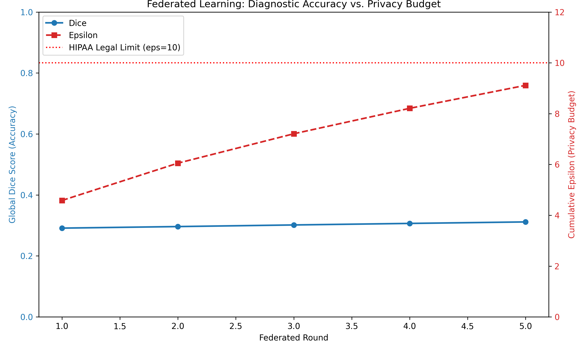

# Phase 6 Clinical Audit Report

## 1. Accuracy vs Privacy Trade-off
The following chart demonstrates the cumulative privacy expenditure against model convergence.

## 2. Final Metrics
- **Final Global Dice Score**: 0.3115
- **Final Cumulative Epsilon**: 9.1137
- **Status**: [COMPLIANT]
